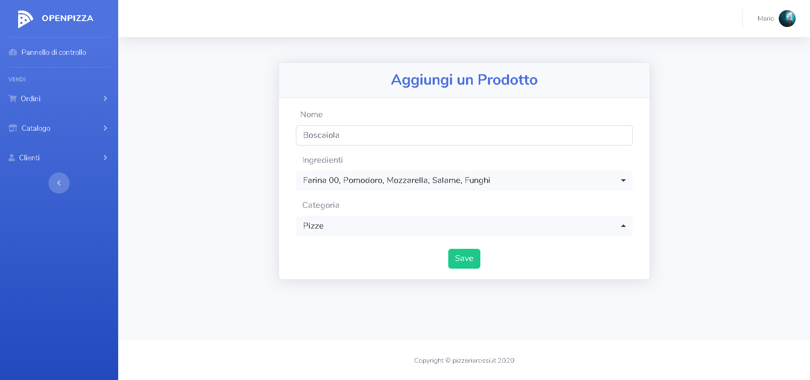
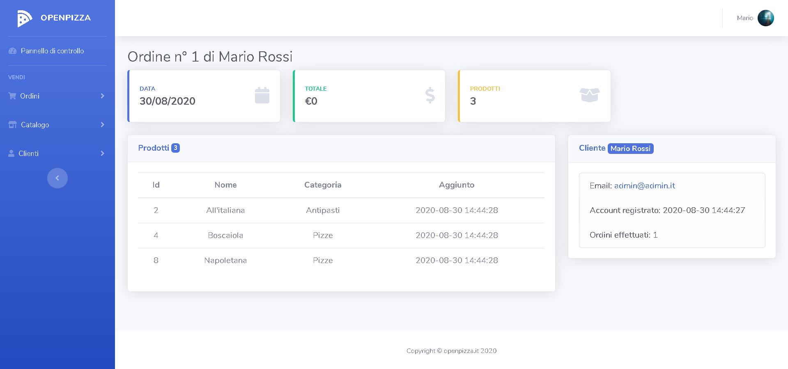

</p>

# OpenPizza

<a href="#"></a>
<a href="#"></a>
<a href="#"></a>

## About OpenPizza

OpenPizza nasce come soluzione Gratis e Open Source per gestire le Ordinazioni nelle Pizzerie.
Come si può notare, il progetto è in uno stato embrionale, ma nei prossimi mesi cercherò di espanderne le funzionalità e migliorare ciò che è stato già scritto.

Il progetto cerca di seguire tutte le Best Practices per facilitarne lo sviluppo e la manutenzione.

## Built with

-   [Laravel 7](https://laravel.com/) - The web framework
-   [Laradock](https://laradock.io/) - Laradock is a full PHP development environment for Docker.
-   [Bootstrap 4](https://getbootstrap.com/) - The front-end open source toolkit
-   [SB Admin 2](https://github.com/StartBootstrap/startbootstrap-sb-admin-2) - The Bootstrap 4 admin theme
-   [Bootstrap-select](https://developer.snapappointments.com/bootstrap-select/) - jQuery plugin with intuitive multiselection
-   [jQuery](https://jquery.com/) - jQuery is a JavaScript library
-   [Chart.js](https://www.chartjs.org/) - Simple yet flexible JavaScript charting

## Get Started

ATTENZIONE!

-   La directory di partenza è la root del progetto
-   Si da per scontato che sulla macchina sia già installato Docker

Per provare l'applicazione basterà seguire i seguenti passaggi:

1. Cambiare l'estensione del file .env

```shell
mv .env.example .env
```

2. Generare le chiave

```shell
php artisan key:generate
```

3. Inserire le credeziali del db

```env
DB_CONNECTION=mysql
DB_HOST=mysql
DB_PORT=3306
DB_DATABASE=pizzeriadocker
DB_USERNAME=admin
DB_PASSWORD=password
```

4. Spostarsi nella cartella "laradock"

```shell
cd laradock
```

5. Avviare il container

```shell
docker-compose up -d nginx mysql
```

6. Spostarsi su MySQL

```shell
docker exec -it laradock_mysql_1 bash
```

7. Entrare nel terminale

```shell
mysql -uroot -proot
```

8. Creare l'utente admin e assegnargli i privilegi

```mysql
CREATE USER 'admin'@'localhost' IDENTIFIED WITH mysql_native_password BY 'password';
GRANT ALL PRIVILEGES ON *.* TO 'admin'@'localhost' WITH GRANT OPTION;
CREATE USER 'admin'@'%' IDENTIFIED WITH mysql_native_password BY 'password';
GRANT ALL PRIVILEGES ON *.* TO 'admin'@'%' WITH GRANT OPTION;
```

9. Creare il database

```mysql
CREATE DATABASE IF NOT EXISTS `pizzeriadocker` COLLATE 'utf8_general_ci';
GRANT ALL ON `pizzeriadocker`.* TO 'admin'@'%';
FLUSH PRIVILEGES;
```

10. Entrare nell'Workspace

```shell
docker exec -it laradock_workspace_1 bash
```

11. Caricare i dati di demo preimpostati

```shell
php artisan db:seed
```

12. A questo punto basta recersi all'indirizzo: http://127.0.0.1/ per accedere alla demo.
    Le credenziali per accedere alla Dashboard da Amministratore e per accedere alla parte dell'utente sono le seguenti:

```
Admin = email: "admin@admin.it" pass: "password"
User = email: "user@user.it" pass: "password"
```
