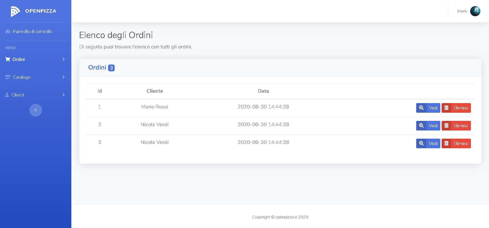

</p>

# OpenPizza

<a href="#"></a>
<a href="#"></a>
<a href="#"></a>

## About OpenPizza

OpenPizza was born as a Free and Open Source solution to manage Orders in Pizzerias during COVID-19.

The project tries to follow all the Best Practices to facilitate their development and maintenance.

## Built with

-   [Laravel 7](https://laravel.com/) - The web framework
-   [Laradock](https://laradock.io/) - Laradock is a full PHP development environment for Docker.
-   [Bootstrap 4](https://getbootstrap.com/) - The front-end open source toolkit
-   [SB Admin 2](https://github.com/StartBootstrap/startbootstrap-sb-admin-2) - The Bootstrap 4 admin theme
-   [Bootstrap-select](https://developer.snapappointments.com/bootstrap-select/) - jQuery plugin with intuitive multiselection
-   [jQuery](https://jquery.com/) - jQuery is a JavaScript library
-   [Chart.js](https://www.chartjs.org/) - Simple yet flexible JavaScript charting

## Get Started

ATTENTION!

-   The starting directory is the root of the project
-   It's assumed that Docker is already installed on the machine

To try the application just follow the steps below:

1. Change the extension of the .env file

```shell
mv .env.example .env
```

2. Generate the key

```shell
php artisan key:generate
```

3. Enter the credentials of the db

```env
DB_CONNECTION=mysql
DB_HOST=mysql
DB_PORT=3306
DB_DATABASE=pizzeriadocker
DB_USERNAME=admin
DB_PASSWORD=password
```

4. Navigate to the "laradock" folder

```shell
cd laradock
```

5. Start the container

```shell
docker-compose up -d nginx mysql
```

6. Navigate to MySQL

```shell
docker exec -it laradock_mysql_1 bash
```

7. Enter the terminal

```shell
mysql -uroot -proot
```

8. Create the admin user and assign them privileges

```mysql
CREATE USER 'admin'@'localhost' IDENTIFIED WITH mysql_native_password BY 'password';
GRANT ALL PRIVILEGES ON *.* TO 'admin'@'localhost' WITH GRANT OPTION;
CREATE USER 'admin'@'%' IDENTIFIED WITH mysql_native_password BY 'password';
GRANT ALL PRIVILEGES ON *.* TO 'admin'@'%' WITH GRANT OPTION;
```

9. Create the database

```mysql
CREATE DATABASE IF NOT EXISTS `pizzeriadocker` COLLATE 'utf8_general_ci';
GRANT ALL ON `pizzeriadocker`.* TO 'admin'@'%';
FLUSH PRIVILEGES;
```

10. Enter the Workspace

```shell
docker exec -it laradock_workspace_1 bash
```

11. Load the preset demo data

```shell
php artisan db:seed
```

12. At this point, just go to: http://127.0.0.1/ to access the demo.
    The credentials to access the Dashboard as Administrator and to access the User side are the following:

```
Admin = email: "admin@admin.it" pass: "password"
User = email: "user@user.it" pass: "password"
```
